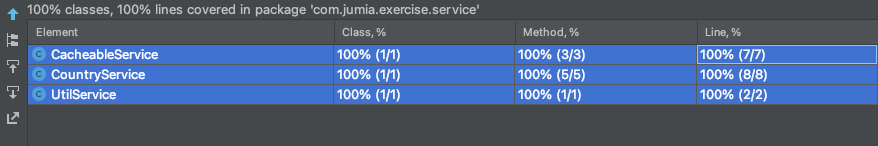
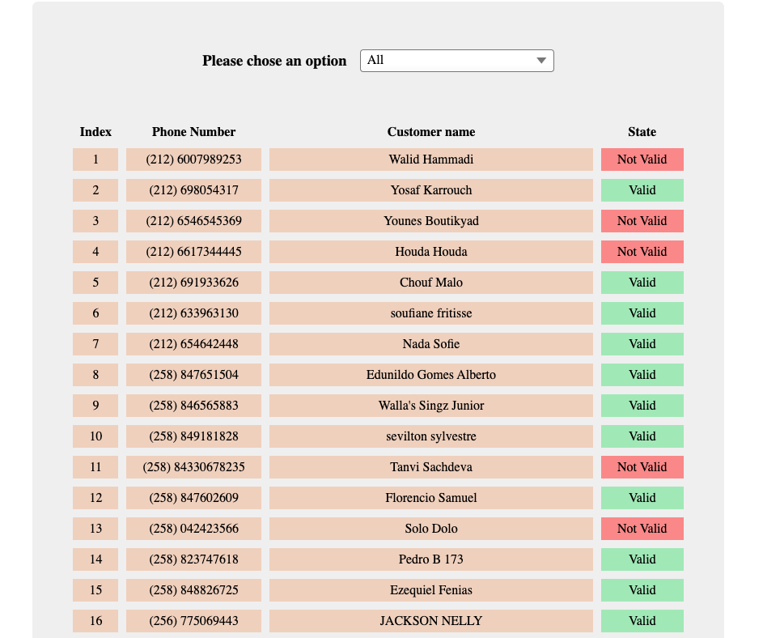

# Jumia Exercise

To list and categorize country phone numbers.
<br>
Phone numbers are categorized by country, state (valid or not valid), country code and number. The page
renders a list of all phone numbers available in the DB abd it filters by country & state.
<br>

### Built With
1. Java 8
2. Springboot 2.5.6
3. Spring data jpa
4. Spring web
5. Lombok
6. Junit
7. Spring caching

<br>

`CacheableService.getCustomerList()` is used for caching the database result after getting the customer list for the first time.
Then it makes in-memory search / filter instead of calling database everytime.
<br>
To be enhanced by integrate with redis server and refresh this cache after modifying the database list.

<br>
<h4>Unit Tests coverage</h4>




### Getting Started
To get a local copy up and running follow these example steps.

####Prerequisites
1. JDK 8 or higher
2. Maven
3. Docker

<br>
Please open a command line (or terminal) and navigate to the folder where you have the
project files <b>exercise</b>. then perform the following commands

```sh
cd /exercise
```

<br>
Building form source code and generate the war file

```sh
mvn clean package
```

<br>
Building a docker image 

```sh
docker build -t jumia-exercise:1.0 .
```

<br>
Start the image container

```sh
docker run -p 8080:8080 -t jumia-exercise:1.0
```

<br>
Finally go to 

[Home Page](http://localhost:8080) (http://localhost:8080)


